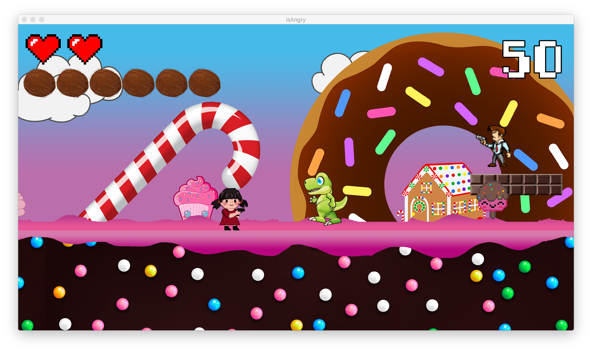
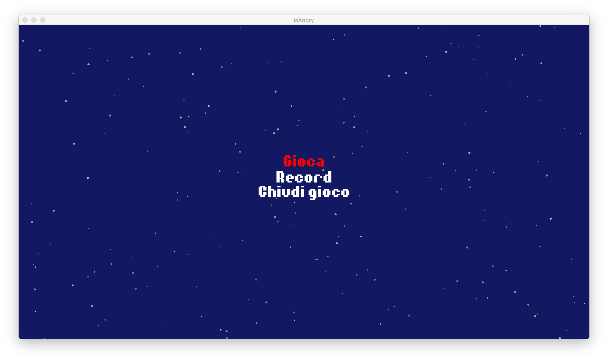

# isAngry
isAngry è un video-game platform bidimensionale a scorrimento orizzontale, dove il personaggio principale deve evitare gli ostacoli, sparare contro tutti i nemici che appaiono sullo schermo e contemporaneamente raccogliere caramelle.
## Comandi
`A` -> muovi a sinistra 
`D` -> muovi a destra 
`W` -> salto 
`S` -> scendi dalla piattaforma
`SPAZIO` -> spara 
`ESC` -> pausa 
--->La navigazione dei menù è affidata alle `FRECCE DIREZIONALI, W, S e INVIO`
 Le caramelle aumentano il rate di fuoco
## Conclusione
L'abilità del giocatore sta quindi nella velocità a sparare prima di essere preso, riflessi e capacità a muovere il personaggio.

